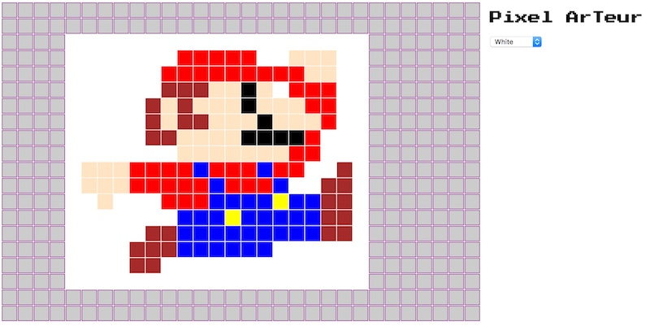
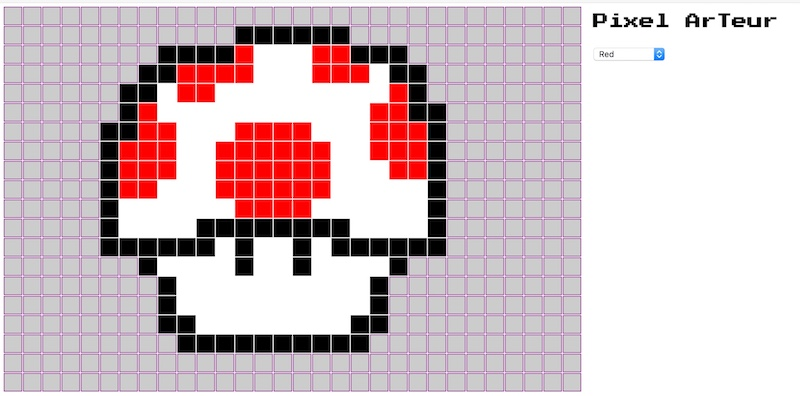
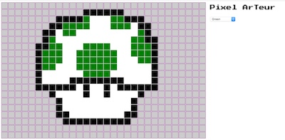
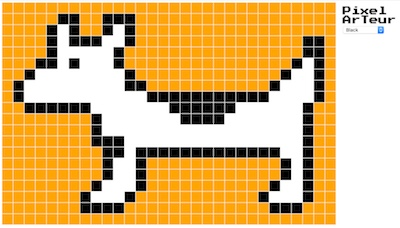
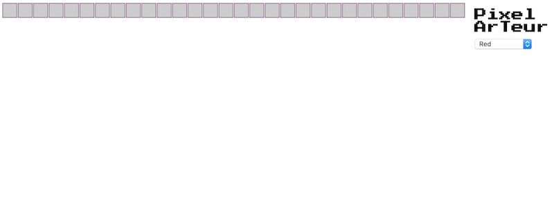
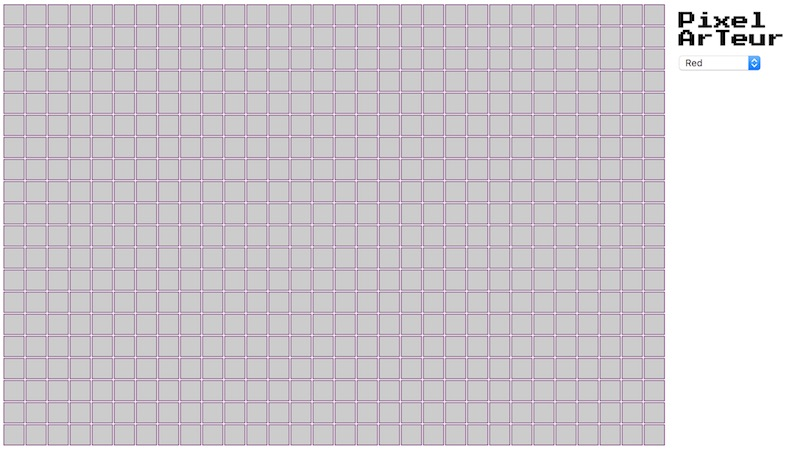
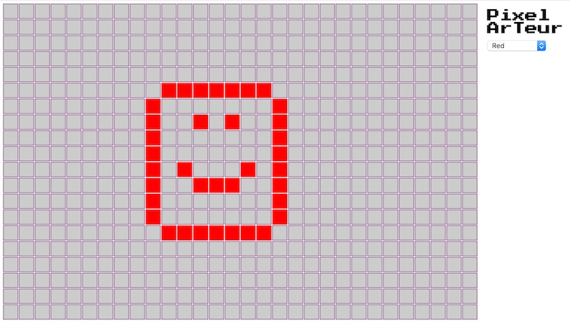

# "Pixel Artist" Web Application Exercise

## Overview
- In this assignment you will create a simple pixel art application. The user will be able to click or drag in a grid, which will then fill with whatever color they have chosen in the HTML &lt;select> on the right.
- the grid is comprised of &lt;span> tags that have been created procedurally, and then added to both the page and to a 2-dimensional array.
- all of the cells have been placed in `<div id="gridContainer"></div>` and a single event handler has been attached to this &lt;div>, rather than to each cell (because there are 600 cells!).
- When the &lt;div> is clicked on, we grab the x,y of that click, and then calculate which cell was clicked on based on the x,y of the click, the width of the cells, and the top & left margins of the &lt;div>.
- This exercise could possibly be extended into your Project 4, or into a personal portfolio piece:
    - The features and polish of the application could be extended and improved. For example, create clickable color swatches rather than a pull down menu, the ability to save creations locally in the user's browser via `localStorage`, and so on.
    - Or, now that you have a working grid, you could create an entirely different kind of experience--for example a tile-based board game like Minesweeper or Othello, or an artificial life simulator like Conway's Game of Life - http://pmav.eu/stuff/javascript-game-of-life-v3.1.1/
    
### Screen Shots





## Instructions


### Getting Started

Here is your starting file with the HTML and CSS all done for you. Copy and paste the code into a new HTML document and save it with the name **pixel-artist.html**

#### pixel-artist.html

```html
<!DOCTYPE html>
<html lang="en">
<head>
	<meta charset="utf-8" />
	<title>Pixel Arteur</title>
	<link href="https://fonts.googleapis.com/css?family=Press+Start+2P" rel="stylesheet">
	<style>
	span.cell{
		height:23px;
		width:23px;
		border:1px solid purple; /* actual width & height is 25px because of border */
		background-color: #ccc;
		padding:0;
		margin:0;
		position:absolute;
	}
	
	/* Get rid of the cell border when it is selected */
	span.cellSelected{
		height:25px;
		width:25px;
		background-color: red;
		padding:0;
		margin:0;
		position:absolute;
	}
	
	#gridContainer{
		top:5px;
		left:5px;
		padding:0;
		display:inline-block;
		position:absolute;
	}
	
	#colorChooser{
		position: absolute;
		top: 65px;
		left:800px;
	}
	
	h1{
		font-family: 'Press Start 2P', cursive;
		display: inline-block;
		position:absolute;
		font-size:1.3em;
		top: 0;
		left:800px;
	}
	
	</style>
</head>
<body>
<div id="gridContainer"></div>
<h1>Pixel ArTeur</h1>
<select id="colorChooser">
	<option value="aqua">Aqua</option>
	<option value="Bisque">Bisque</option>
	<option value="black">Black</option>
	<option value="blue">Blue</option>
	<option value="brown">Brown</option>
	<option value="chocolate">Chocolate</option>
	<option value="cyan">Cyan</option>
	<option value="DarkGray">Dark Gray</option>
	<option value="green">Green</option>
	<option value="red" selected>Red</option>
	<option value="magenta">Magenta</option>
	<option value="orange">Orange</option>
	<option value="tan">Tan</option>
	<option value="white">White</option>
	<option value="wheat">Wheat</option>
	<option value="WhiteSmoke">WhiteSmoke </option>
	<option value="yellow">Yellow</option>
</select>

<script>

</script>
</body>
</html>

```

**Which looks like this:**


### II. Set up some constants, and start creating a grid

To get our grid of "cells" set up and visible, add the following code to the script tag at the bottom of the document: 

1. The following constant values. Naming these values makes our code easier to read (both for others, and for our future selves if we come back and look at this code again in the future). These variables are all "Script Scoped" so they will be visible to all the code in script. We are using `const` because we don't want these values to be re-assigned by our code later.
  - `const numCols = 30;`
  - `const numRows = 20;`
  - `const cellWidth = 25;`
  - `const cellSpacing = 1;`

2. Create a constant value for the gridContainer ID, which will hold all of our cells.
  - `const container = document.querySelector('#gridContainer');`

3. Create a new &lt;span> element, and give it the class of `cell`. Note that because the word `class` is reserved in JavaScript, we set and get an element's class attribute value by using the `.className` property. (Also, why a &lt;span> element? No particular reason - since span is typically used as a "generic in-line element", it's a reasonable choice.)
  - `const span = document.createElement('span');`
  - `span.className = 'cell';`

4. Declare an array for the cells:
  - `const cells = [];`

5. Add a for loop to create one row of the grid. Note that we are using `span.cloneNode()` to make a copy of `span`, rather than using `createElement()` again. We also add each cell to both our array and the `gridContainer`.

```javascript
for (let col=0;col<numCols;col++) {
    let cell = span.cloneNode();
    cell.style.left = `${col * (cellWidth+cellSpacing)}px`;
    cell.style.top = "0";
    container.appendChild(cell);
    cells.push(cell);
```

Now check the page. If you've done this correctly, you should now see a 1x30 grid!



If you take a peek in the Web Inspector, you should see this:

##### The `cells` array and other script variables are visible in the debugger:


##### The &lt;span> elements we created and added to the page DOM are visible under the **Elements** tab:


### Finish creating the grid
To create all 20 rows of the grid, and a 2-dimensional array to hold them, we'll add a new loop that creates an array for each of the rows. We also calculate the vertical position for new row, rather than setting it to an absolute value of 0. Finally, we add both the row and column position of the cell to the array. 

```javascript
for (let row = 0; row < numRows; row++) {
	cells.push([]);
	for (let col = 0; col < numCols; col++) {
		let cell = span.cloneNode();
		cell.style.left = `${col * (cellWidth + cellSpacing)}px`;
		cell.style.top = `${row * (cellWidth+cellSpacing)}px`;
		container.appendChild(cell);
		cells.push(cell);
		cells[row][col] = cell;
	}
}
``` 

**Reload the page. You should see all 20 rows now:**


### IV. Get basic clicking working

Clicking on a cell should turn it to the selected color - let's get that working now.

1. Define a script-level variable of `color` that will hold the currently selected color. For now, hard code the value to "red" (a CSS keyword color that evaluates to #FF0000). 

3. Add an `onclick` event listener to the container, and have it call the `fillCell` function. This gives us a single click event that can handle all of the cells, rather than each cell (600 of them!) having their own click event handler. However, to change only one cell inside the container, we'll have to have our fillCell function figure out which cell we clicked on. 

2. Create the `fillCell` function to change the color of a specific cell. We'll be passing in the click coordinates as "e", so `e.clientX` and `e.clientY` give us the exact `window` coordinates of the mouse click. To determine which cell in the array they clicked on, we need to calculate how far from the edge of the window the container &lt;div> is (that's what `getBoundingRect()` does), and use both the width and the spacing of the cells in our calculations. Note that we are setting the `className` property (NOT .class) to `cellSelected`, which removes the cell border for that cell.
```javascript
function fillCell(e) {
	let rect = container.getBoundingClientRect();
	let mouseX = e.clientX - rect.left;
	let mouseY = e.clientY - rect.top;
	let columnWidth = cellWidth+cellSpacing;
	let col = Math.floor(mouseX/columnWidth);
	let row = Math.floor(mouseY/columnWidth);
	let selectedCell = cells[row][col];
	selectedCell.className = 'cellSelected';
	selectedCell.style.backgroundColor = color;
	console.log(`${col},${row}`);
}
```

**Congratulations! You now have the MVP (Minimum Viable Product) of your app! Clicking on a cell turns it red!**




### V. Get dragging working
Right now we can click on individual cells to change their color, but it would be so much better if we could click and then drag the mouse to "paint" multiple pixels. Let's make that happen.

1. Create a script variable -  `mouseIsDown` - to keep track of whether the mouse is currently down. Initialize it with a value of `false`.

2. When the mouse is held down, we want to fill the cells we drag over. But when moving the mouse, we don't want the browser to use its default behavior of highlighting selected elements. We'll accomplish this by using the `preventDefault` method to stop the default behavior of a `mousemove`, and we want to call `fillCell()` whenever we move the mouse. 

```javascript
container.onmousemove = (e) => {
	e.preventDefault();
	if (mouseIsDown) fillCell(e);
}
```

3. Set the `mouseIsDown` value to true or false depending on user behavior. In the first instruction, we're looking for every time the mouse button is pressed while the mouse is inside the container; in the second, we're looking for every time the mouse button is released anywhere in the window, in case the user drags out of the container area. 
```javascript
container.onmousedown = (e) => {
	e.preventDefault();
	mouseIsDown = true;
}

window.onmouseup = (e) => {
	e.preventDefault();
	mouseIsDown = false;
}
```


**Reload the page and try it out, you should now be able to click and drag and paint multiple cells.**


### VI. Get the color chooser working

To change the color we're painting with, we need to modify the `color` variable based on the selection in the #colorchooser select element. 

```javascript
document.querySelector("#colorChooser").onchange = (e)=> {
    color = e.target.value;
}
```
**Reload the page and try it out, you should now be able to choose different fill colors.**


### VI. Deliverable
When it's done, upload your completed pixel-artist.html file to your igme230 folder on banjo.rit.edu, and link to it from your main class page as "Pixel Artist Exercise". It must be completed by 11:59pm on Friday, November 3. 

### VII. Discussion

- That's enough for now - congratulations are in order for your copying and pasting skills! Make sure you really understand what each line of code here is doing, though. 

- Did you notice that for this pixel art application, we actually don't need the 2 dimensional array and the "which cell did the user click in" code? Actually, `e.target.style.backgroundColor = color;` would have been enough.

- The reason we over-engineered this example was so that you could take this "grid" example and extend it by creating different kinds of tile-based apps if you desired to. Here's one example of what you could do - [*Conway's Game of Life*](gameoflife/gameoflife.md)

- Recall that your 2D array `cells` is an array of `HTMLELement` objects - and that you can add properties to these elements by using HTML 5 Custom Data attributes - like this:  `cell.setAttribute('data-hitpoints','25');` or `cell.setAttribute('data-tileType','grass');`. Some nice examples of using this API are here: http://html5doctor.com/html5-custom-data-attributes/


